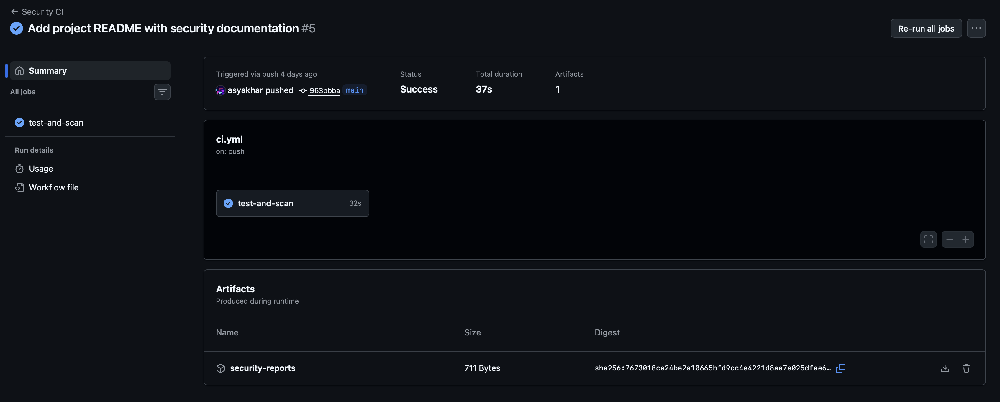
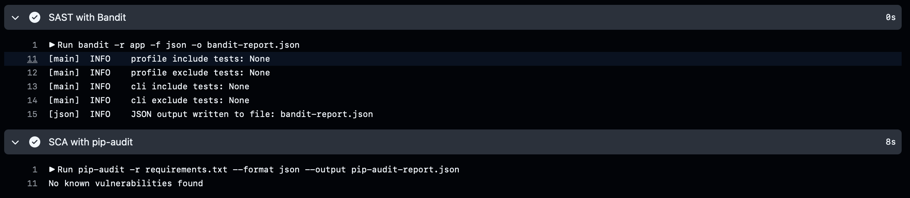
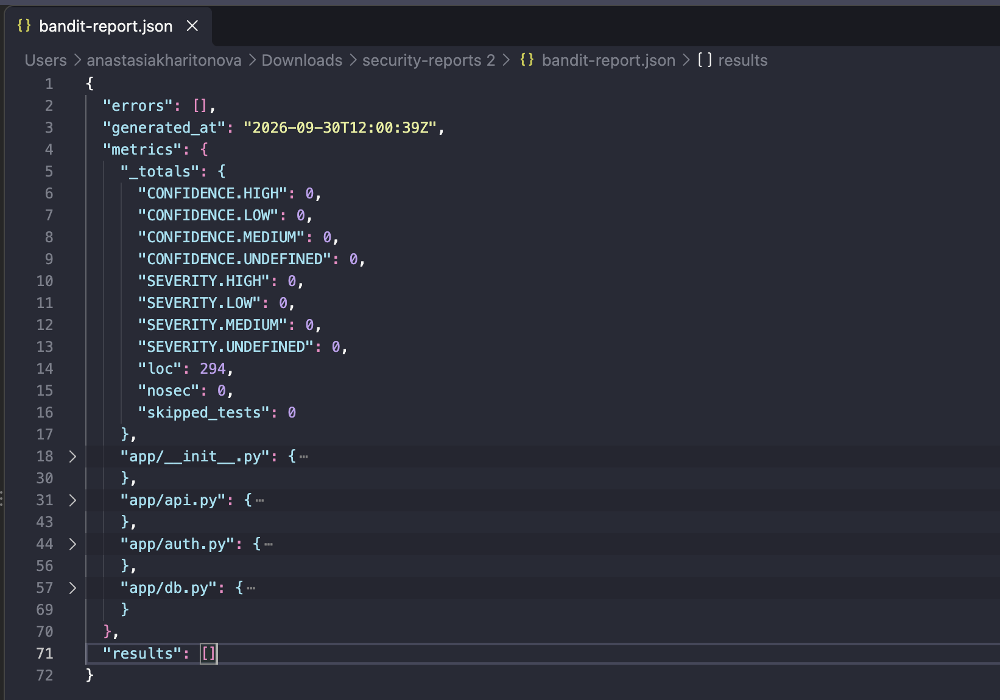

# Dragon Keepers API

[](https://github.com/asyakhar/dragon-keepers-secure-api/actions/workflows/ci.yml)

Учебный API на Flask для лабораторной работы по информационной безопасности. Это реестр всадников и их драконов: всадник входит в систему, получает JWT-токен и после этого может посмотреть свою коллекцию или добавить в неё нового дракона.

У каждого всадника своя коллекция. Идентификатор владельца берётся из проверенного токена, поэтому передать в запросе чужой `rider_id` и получить чужие данные нельзя.

## Что есть в API

| Метод | Адрес | Что делает | Нужен токен |
|---|---|---|---|
| `GET` | `/health` | Проверяет, что приложение запущено | нет |
| `POST` | `/auth/login` | Проверяет логин и пароль, возвращает JWT | нет |
| `GET` | `/api/data` | Возвращает коллекцию текущего всадника | да |
| `POST` | `/api/dragons` | Добавляет дракона в коллекцию текущего всадника | да |

Для защищённых запросов токен передаётся в заголовке:

```text
Authorization: Bearer <JWT>
```

### Авторизация

```bash
curl -X POST http://127.0.0.1:5000/auth/login \
  -H 'Content-Type: application/json' \
  -d '{"username":"student","password":"YOUR_PASSWORD"}'
```

При правильных данных сервер отвечает примерно так:

```json
{
  "access_token": "eyJ...",
  "expires_in": 1800
}
```

Токен действует 30 минут. Для следующих примеров его можно сохранить в переменную:

```bash
export ACCESS_TOKEN='PASTE_TOKEN_HERE'
```

### Получение коллекции

```bash
curl http://127.0.0.1:5000/api/data \
  -H "Authorization: Bearer $ACCESS_TOKEN"
```

Без токена или с повреждённым токеном сервер вернёт `401 Unauthorized`.

### Добавление дракона

```bash
curl -X POST http://127.0.0.1:5000/api/dragons \
  -H 'Content-Type: application/json' \
  -H "Authorization: Bearer $ACCESS_TOKEN" \
  -d '{
    "name": "Буревестник",
    "species": "Грозовой дракон",
    "element": "storm",
    "age": 42,
    "description": "Разведчик северной эскадрильи"
  }'
```

Разрешённые стихии: `fire`, `ice`, `storm`, `earth`, `shadow`, `light`. Имя должно содержать от 2 до 50 символов, вид — от 2 до 80, описание — не больше 500 символов. Возраст задаётся целым числом от 0 до 10 000. Два дракона с одинаковым именем у одного всадника создать нельзя.

## Как запустить проект

Нужен Python 3.12.

```bash
python3 -m venv .venv
source .venv/bin/activate
python -m pip install -r requirements-dev.txt
export JWT_SECRET="$(python -c 'import secrets; print(secrets.token_hex(32))')"
flask --app app init-db
flask --app app run
```

`flask --app app init-db` попросит придумать логин и пароль, создаст таблицы и добавит в коллекцию двух демонстрационных драконов. Пароль должен быть не короче 12 символов и содержать строчную и заглавную буквы, цифру и специальный символ.

## Что сделано для защиты

### SQL-инъекции

Пользовательский ввод не подставляется в SQL-строку. Во всех запросах к SQLite используются параметры `?`, а значения передаются отдельным кортежем:

```python
user = get_db().execute(
    "SELECT id, username, password_hash FROM riders WHERE username = ?",
    (username,),
).fetchone()
```

За счёт этого строка вроде `' OR 1=1 --` остаётся обычным значением поля `username`, а не становится частью SQL-команды. В тестах отдельно проверяется попытка входа с такой строкой: сервер отвечает `401`, как и при обычном неправильном пароле.

Дополнительно запросы к драконам всегда содержат условие `rider_id = ?`. Значение `rider_id` берётся не из JSON клиента, а из уже проверенного JWT. Это не даёт одному всаднику прочитать коллекцию другого.

### XSS

API работает с JSON и не формирует HTML-страницы, но текстовые поля всё равно считаются недоверенными. Перед сохранением проверяются типы, длина и допустимые значения. При выдаче `name`, `species` и `description` проходят через `html.escape(..., quote=True)`.

Например, введённое значение `<script>alert(1)</script>` возвращается как `&lt;script&gt;alert(1)&lt;/script&gt;` и не может выполниться как JavaScript. Это поведение проверяется автотестом как для тега `<script>`, так и для обработчика `onerror` внутри ``.

Ответы также получают заголовки:

- `Content-Security-Policy: default-src 'none'; frame-ancestors 'none'`;
- `X-Content-Type-Options: nosniff`;
- `X-Frame-Options: DENY`;
- `Referrer-Policy: no-referrer`;
- `Cache-Control: no-store`.

Размер тела запроса ограничен 16 КБ, что защищает приложение от слишком больших входных данных.

### Аутентификация и пароли

Пароли не хранятся в открытом виде. При создании всадника пароль хэшируется с помощью `bcrypt` с коэффициентом стоимости 12. Соль создаётся библиотекой отдельно для каждого хэша. При входе используется `bcrypt.checkpw()`, а клиенту в любом случае показывается одинаковая ошибка `Invalid credentials` — по ответу нельзя понять, существует ли такой логин.

После входа сервер выдаёт JWT, подписанный алгоритмом HS256. В токене есть:

- `sub` — идентификатор всадника;
- `iat` и `exp` — время выпуска и окончания действия;
- `iss` и `aud` — издатель и получатель токена;
- `jti` — уникальный идентификатор токена.

Перед выполнением защищённого эндпоинта проверяются подпись, срок действия, обязательные поля, издатель, аудитория и наличие всадника в базе. Секрет подписи берётся из переменной окружения `JWT_SECRET`; в репозиторий он не добавляется.

## Тесты и проверки безопасности

Локально все проверки можно запустить тремя командами:

```bash
python -m pytest -q
bandit -r app
pip-audit -r requirements.txt
```

В репозитории эти же проверки выполняются автоматически через workflow [Security CI](https://github.com/asyakhar/dragon-keepers-secure-api/actions/workflows/ci.yml). Он запускается при каждом `push` и `pull_request`.

### Успешный запуск CI

На скриншоте показан запуск `Security CI #5`: задача `test-and-scan` завершилась успешно. Внизу страницы доступен артефакт `security-reports` с JSON-отчётами сканеров.



### SAST: проверка исходного кода с помощью Bandit

Bandit просматривает Python-код и ищет потенциально небезопасные конструкции. В workflow он запускается командой `bandit -r app -f json -o bandit-report.json`. Проверка завершилась успешно, после чего результат был записан в `bandit-report.json`.

На этом же скриншоте виден результат SCA-проверки: `pip-audit` не обнаружил известных уязвимостей в зависимостях проекта.



В отчёте Bandit массив `results` пуст, а количество замечаний уровней Low, Medium и High равно нулю. Всего было проверено 294 строки кода, пропущенных тестов и подавленных предупреждений нет.



Полный журнал последнего проверенного запуска находится в [GitHub Actions](https://github.com/asyakhar/dragon-keepers-secure-api/actions/runs/36712009332).

